# Informe – TP Integrador de Machine Learning

**Materia:** Machine Learning — UAI
**Objetivo:** Implementar distintos algoritmos de Machine Learning mediante una aplicación de consola en Python, aplicando cada uno sobre datasets diferentes a los utilizados en los ejemplos de la materia.

> Este documento se actualiza a medida que se completan los algoritmos del trabajo. Las secciones marcadas como **Pendiente** corresponden a partes del TP todavía no implementadas o no ejecutadas.

---

## Índice

1. [KNN](#1-knn)
2. [Regresión lineal simple](#2-regresión-lineal-simple)
3. [Regresión lineal múltiple](#3-regresión-lineal-múltiple)
4. [Regresión polinomial](#4-regresión-polinomial)
5. [SVR (Support Vector Regression)](#5-svr-support-vector-regression)
6. [Árbol de decisión (regresión)](#6-árbol-de-decisión-regresión)
7. [Pendientes generales](#7-pendientes-generales)

---

## 1. KNN

**Algoritmo:** K-Nearest Neighbors, clasificación con `n_neighbors=5`.

### Dataset: Iris

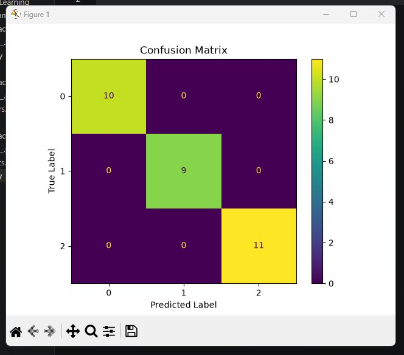

**Resultados:** Accuracy = 1.0000, Precision = 1.0000, Recall = 1.0000, F1 Score = 1.0000.

**Análisis:** Sobre las 30 muestras del set de test, el modelo clasificó correctamente las tres clases (Setosa, Versicolor y Virginica) sin ningún error, como se observa en la diagonal completa de la matriz de confusión. Este resultado es coherente con lo esperado: Iris es un dataset ampliamente utilizado como benchmark introductorio justamente porque sus clases están bien separadas geométricamente, en particular Setosa, que se distingue trivialmente de las otras dos especies. Un accuracy del 100% con KNN sobre este dataset es un resultado típico y no indica overfitting dado el tamaño y la separabilidad del problema.

### Dataset: Wine

**Pendiente** de ejecución.

### Dataset: Digits

**Pendiente** de ejecución.

---

## 2. Regresión lineal simple

**Algoritmo:** `LinearRegression` de scikit-learn, utilizando una sola variable predictora por dataset.

### Dataset: Diabetes (variable `bmi`)

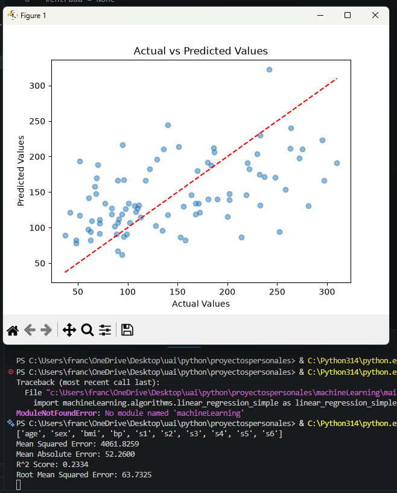

**Resultados:** MSE = 4061.8259, MAE = 52.2600, R² = 0.2334, RMSE = 63.7325.

**Análisis:** Utilizando únicamente el índice de masa corporal (`bmi`) como variable predictora, el modelo explica solo el 23% de la variación en la progresión de la diabetes. Este resultado es esperable: la progresión de la enfermedad es un fenómeno multifactorial que depende de variables adicionales (presión arterial, niveles de glucosa, colesterol, etc.), por lo que una sola variable, aunque correlacionada con el target, no alcanza para capturar la complejidad del fenómeno.

### Dataset: California Housing (variable `MedInc`)

**Pendiente** de ejecución.

### Dataset: Boston Housing (variable `RM`)

**Pendiente** de ejecución.

---

## 3. Regresión lineal múltiple

**Algoritmo:** `LinearRegression` de scikit-learn, utilizando todas las variables numéricas disponibles.

### Dataset: California Housing

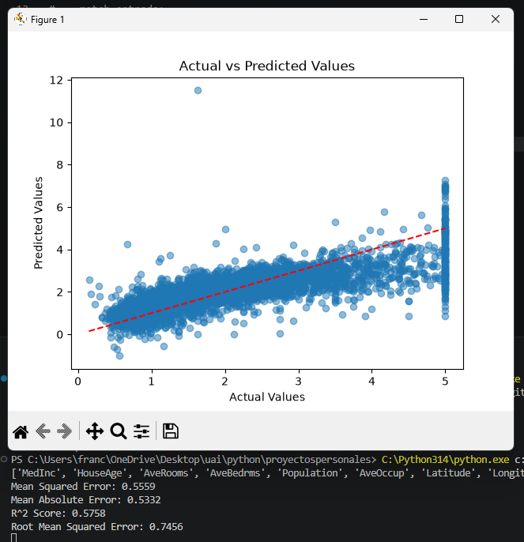

**Resultados:** MSE = 0.5559, MAE = 0.5332, R² = 0.5758, RMSE = 0.7456.

**Análisis:** Utilizando las 8 variables disponibles (ingreso medio, antigüedad de la vivienda, habitaciones promedio, etc.), el modelo explica el 58% de la variación en el precio de las viviendas, una mejora considerable frente a usar una sola variable. Se observa en el gráfico una franja vertical de puntos en el valor real `5` (equivalente a USD 500.000): esto se debe a que el dataset original censura los precios en ese valor, registrando como `5.0` cualquier vivienda que en realidad valga más. Esta censura limita el desempeño máximo alcanzable por cualquier modelo sobre este dataset, independientemente del algoritmo utilizado.

### Dataset: Wine Quality

**Pendiente** de ejecución.

### Dataset: Automobile

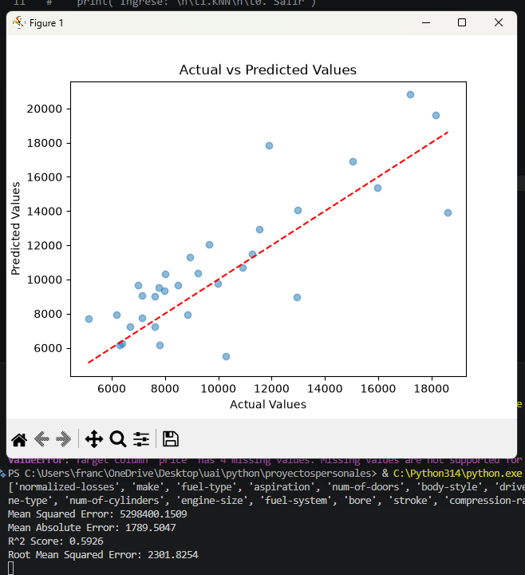

**Resultados:** MSE = 5298400.1509, MAE = 1789.5047, R² = 0.5926, RMSE = 2301.8254.

**Análisis:** El modelo explica el 59% de la variabilidad en el precio de los autos, utilizando únicamente las variables numéricas del dataset (motor, dimensiones, peso, etc.). Se descartaron las variables categóricas (marca, tipo de combustible, estilo de carrocería, etc.), que probablemente tengan poder predictivo adicional no capturado en este modelo; una mejora futura sería aplicar codificación one-hot sobre dichas variables.

**Nota de preprocesamiento:** este dataset requirió tres correcciones previas al entrenamiento: (1) el nombre correcto en OpenML es `"autos"`, no `"automobile"`; (2) el target por defecto de OpenML es `symboling` (un puntaje de riesgo asegurador), no el precio, por lo que fue necesario extraer manualmente la columna `price` como target; (3) el dataset contiene 4 valores faltantes en `price` y varios valores faltantes (`"?"`) en columnas numéricas, que se resolvieron seleccionando solo columnas numéricas y aplicando `dropna()` sobre el conjunto combinado de variables y target.

---

## 4. Regresión polinomial

**Algoritmo:** `PolynomialFeatures(degree=2)` + `LinearRegression`, utilizando todas las variables numéricas disponibles.

### Dataset: Diabetes

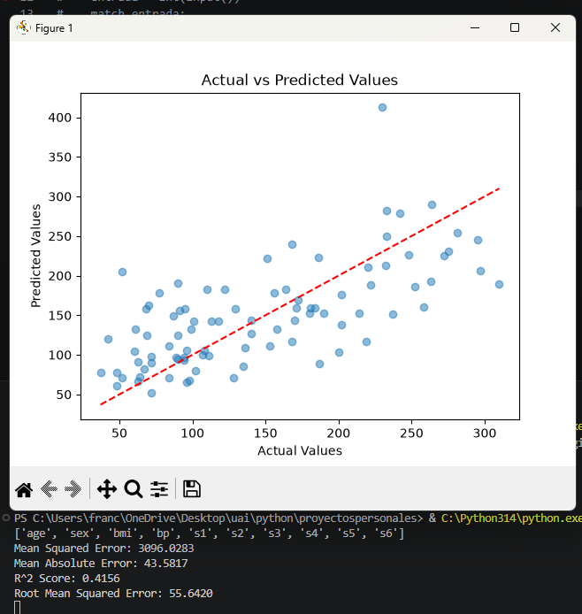

**Resultados:** MSE = 3096.0283, MAE = 43.5817, R² = 0.4156, RMSE = 55.6420.

**Análisis:** Se esperaba que agregar términos polinómicos mejorara el ajuste respecto a un modelo lineal. Sin embargo, al aplicar grado 2 sobre las 10 variables del dataset, la transformación generó 66 columnas nuevas (cuadrados y productos cruzados), una cantidad alta en relación a las 442 muestras disponibles (~353 para entrenamiento). Esta alta dimensionalidad relativa favorece el sobreajuste, limitando la capacidad de generalización del modelo sobre el conjunto de test.

### Dataset: California Housing

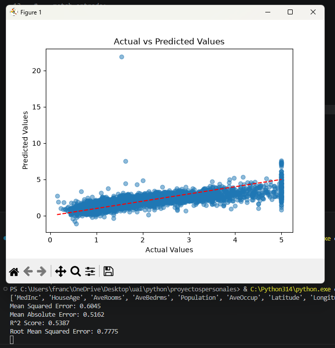

**Resultados:** MSE = 0.6045, MAE = 0.5162, R² = 0.5387, RMSE = 0.7775.

**Análisis:** Con aproximadamente 16.500 muestras de entrenamiento frente a las 45 columnas generadas por la transformación polinomial sobre las 8 variables originales, el riesgo de sobreajuste es considerablemente menor que en Diabetes, lo cual se refleja en un R² más alto. Persiste en el gráfico la misma franja vertical en el valor `5` observada en regresión múltiple, producto de la censura de precios del dataset original.

### Dataset: Synthetic (`make_regression`)

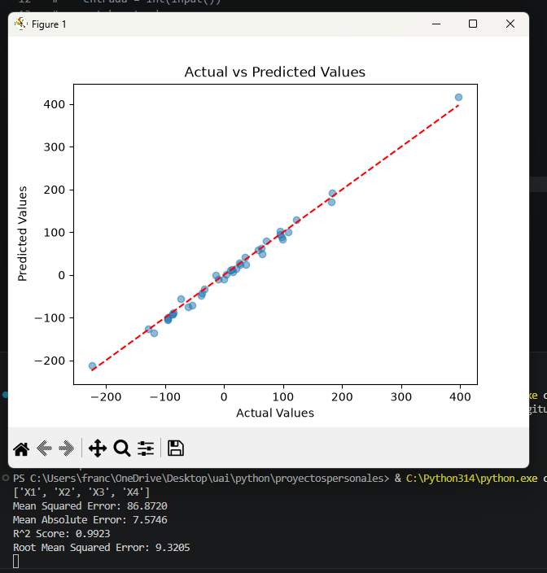

**Resultados:** MSE = 86.8720, MAE = 7.5746, R² = 0.9923, RMSE = 9.3205.

**Análisis:** Al tratarse de datos generados artificialmente con una relación matemática controlada y bajo nivel de ruido (`noise=10`), se esperaba un ajuste casi perfecto, lo cual se confirma con un R² de 0.99. Este resultado funciona como validación de que el pipeline de transformación polinomial y ajuste lineal está correctamente implementado: ante una relación simple y datos limpios, el modelo logra recuperarla casi en su totalidad.

**Conclusión general de la sección:** el desempeño del modelo no depende únicamente de agregar complejidad (términos polinómicos), sino de la relación entre la cantidad de variables generadas y la cantidad de datos disponibles. El dataset sintético, con una relación controlada y suficientes muestras relativas a sus variables, logra el mejor ajuste; Diabetes, con pocas muestras y alta dimensionalidad tras la transformación, es el caso más afectado por el sobreajuste.

---

## 5. SVR (Support Vector Regression)

**Algoritmo:** `SVR` de scikit-learn (kernel RBF por defecto).

### Dataset: California Housing

**Sin escalar las variables:**

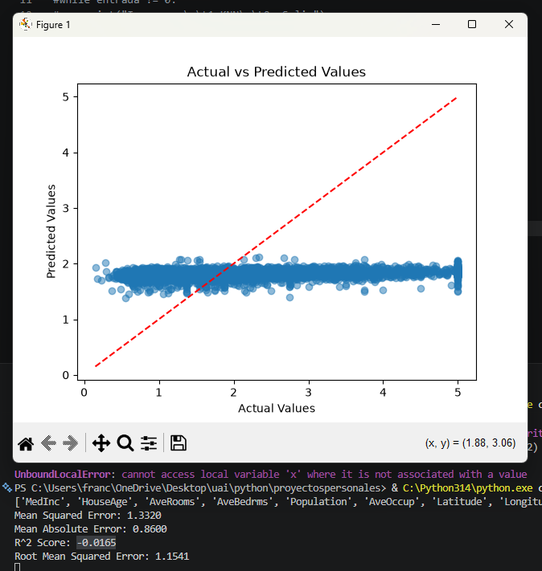

**Resultados:** MSE = 1.3320, MAE = 0.8600, R² = -0.0165, RMSE = 1.1541.

**Con `StandardScaler` aplicado a las variables:**

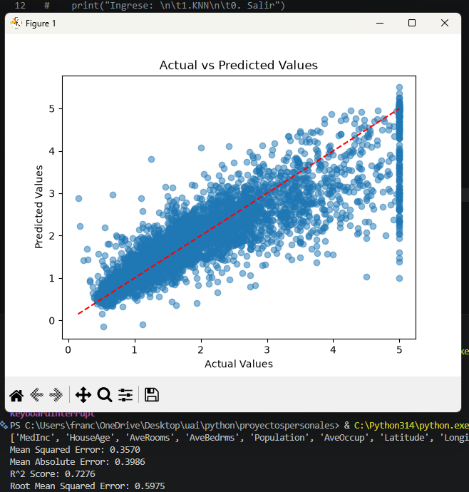

**Resultados:** MSE = 0.3570, MAE = 0.3986, R² = 0.7276, RMSE = 0.5975.

**Análisis:** Sin escalar las variables, el modelo obtuvo un R² negativo, peor que un modelo trivial que siempre prediga el promedio. Esto se debe a que SVR utiliza un kernel basado en distancias (RBF), que calcula la similitud entre puntos considerando todas las variables simultáneamente. Como las variables de California Housing tienen escalas muy dispares (por ejemplo, `Population` alcanza valores de varios miles, mientras que `MedInc` se mueve entre 0.5 y 15), las columnas de mayor magnitud dominaron por completo el cálculo de distancias, distorsionando el aprendizaje. Al aplicar `StandardScaler` antes de entrenar, el R² mejoró drásticamente a 0.7276, el mejor resultado obtenido para este dataset entre todos los algoritmos de regresión probados, superando a la regresión múltiple (0.58) y polinomial (0.54). Esto confirma que el escalado de variables es un paso de preprocesamiento indispensable para algoritmos basados en distancias.

### Dataset: Diabetes

**Con hiperparámetros por defecto (`C=1`):**

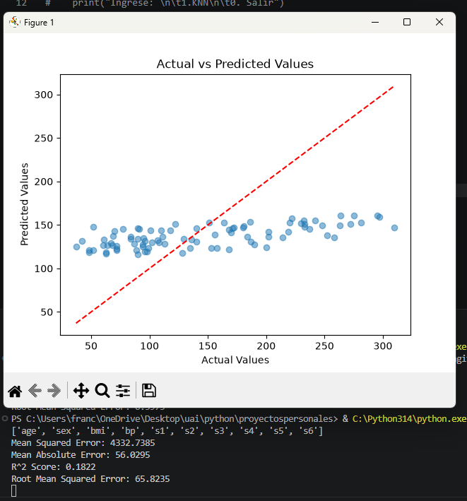

**Resultados:** MSE = 4332.7385, MAE = 56.0295, R² = 0.1822, RMSE = 65.8235.

**Con `C=100`:**

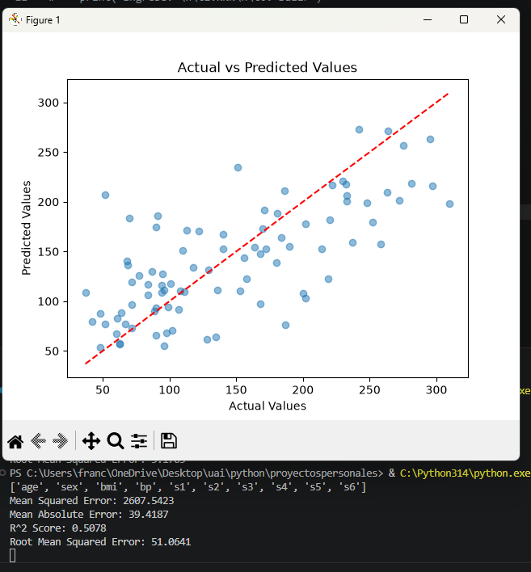

**Resultados:** MSE = 2607.5423, MAE = 39.4187, R² = 0.5078, RMSE = 51.0641.

**Análisis:** Con los hiperparámetros por defecto, SVR mostró un desempeño pobre, prediciendo valores muy cercanos al promedio sin importar el caso particular (visible en el gráfico como una banda horizontal angosta de predicciones). Esto ocurre porque los parámetros `C` y `epsilon` de SVR se expresan en las unidades del target: el target de Diabetes tiene un rango amplio (~25 a 346), mucho mayor que el margen `epsilon` por defecto (0.1), lo cual favorece que el modelo opte por una función casi plana antes que ajustarse al rango real de los datos. Al aumentar `C` a 100, se le otorgó más peso relativo al objetivo de minimizar el error frente al objetivo de planitud, permitiendo que el modelo utilizara pesos más grandes y se ajustara mejor a la escala real del target. El resultado, R² = 0.5078, es el mejor obtenido para Diabetes entre todos los algoritmos de regresión probados en este trabajo.

### Dataset: Energy Efficiency

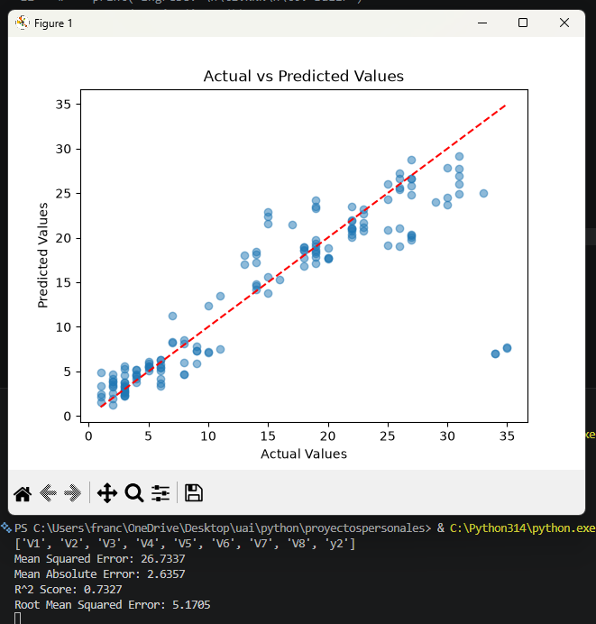

**Resultados:** MSE = 26.7337, MAE = 2.6357, R² = 0.7327, RMSE = 5.1705.

**Análisis:** El modelo alcanza un ajuste sólido, similar al obtenido en California Housing. La mayoría de los puntos caen cerca de la diagonal, coherente con tratarse de un dataset de simulación con relaciones relativamente claras entre las características constructivas del edificio y su carga energética. Se observan dos puntos atípicos con error elevado (valor real ≈34, predicción ≈5), probablemente asociados a una combinación particular de variables de entrada poco representada en el resto del dataset.

**Nota de preprocesamiento:** este dataset requirió varias correcciones: (1) el nombre correcto en OpenML es `"energy-efficiency"` con columnas `y1` (carga de calefacción) e `y2` (carga de refrigeración); (2) se especificó `target_column="y1"` explícitamente; (3) se eliminó `y2` de las variables predictoras para evitar fuga de información (*data leakage*), dado que ambos targets están fuertemente correlacionados; (4) ambos targets estaban tipados incorrectamente como `category` en los metadatos de OpenML pese a ser variables numéricas continuas, por lo que se aplicó `pd.to_numeric()` sobre la columna target.

---

## 6. Árbol de decisión (regresión)

**Algoritmo:** `DecisionTreeRegressor` de scikit-learn.

### Dataset: California Housing

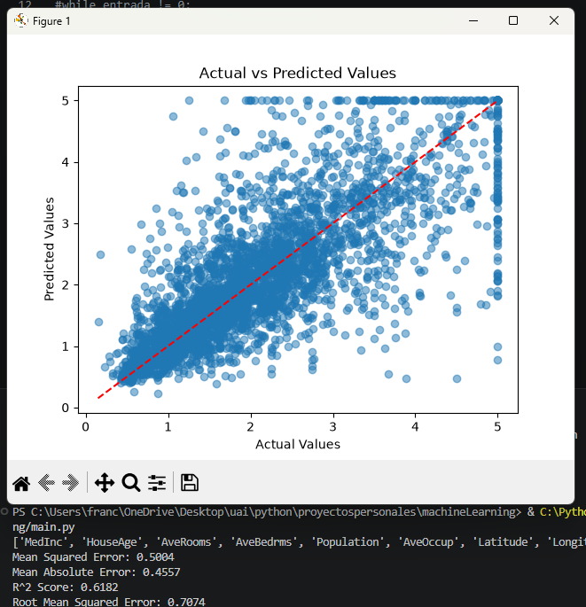

**Resultados:** MSE = 0.5004, MAE = 0.4557, R² = 0.6182, RMSE = 0.7074.

**Análisis:** Con un árbol sin restricciones de profundidad, el modelo obtiene un R² de 0.62, superando a la regresión múltiple (0.58) y polinomial (0.54), aunque por debajo de SVR (0.73). A diferencia de SVR, este algoritmo no requirió ningún escalado de variables, dado que los árboles de decisión dividen los datos comparando un umbral por columna a la vez, por lo que la magnitud de los valores no afecta el resultado.

### Dataset: Diabetes

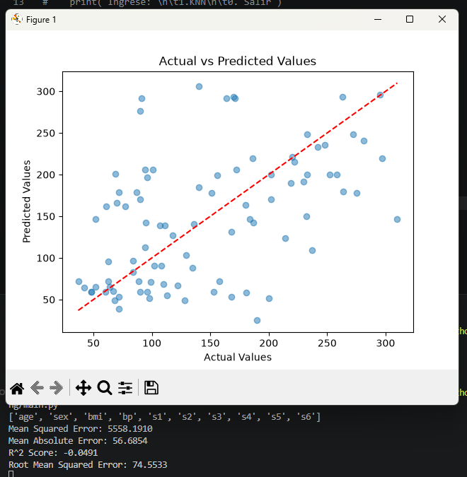

**Resultados:** MSE = 5558.1910, MAE = 56.6854, R² = -0.0491, RMSE = 74.5533.

**Análisis:** El modelo obtiene un R² negativo, peor que predecir siempre el promedio. Esto es un caso claro de sobreajuste (*overfitting*): al no limitar la profundidad del árbol, el modelo continúa dividiendo los datos hasta que cada hoja contiene muy pocas muestras, memorizando particularidades del set de entrenamiento en lugar de aprender un patrón generalizable. Con solo 442 muestras (~353 para entrenamiento) y 10 variables, Diabetes es un dataset pequeño y propenso a este problema. *(Pendiente: repetir el entrenamiento limitando la profundidad del árbol mediante el parámetro `max_depth` y comparar resultados.)*

### Dataset: Bike Sharing

**Pendiente** de ejecución. Durante la carga se detectó que el nombre correcto del dataset en OpenML es `"Bike_Sharing_Demand"` (versión 2), no `"bike-sharing"` versión 1 como se había utilizado inicialmente. Falta confirmar la columna de target correcta antes de entrenar el modelo.

---

## 7. Pendientes generales

- **KNN:** datasets Wine y Digits.
- **Regresión lineal simple:** datasets California Housing y Boston Housing.
- **Regresión lineal múltiple:** dataset Wine Quality.
- **Árbol de decisión (regresión):** corregir y ejecutar Bike Sharing; repetir Diabetes con `max_depth` ajustado.
- **Random Forest (regresión):** Video 31 — California Housing, Diabetes, Air Quality.
- **Regresión logística:** Video 39 — Breast Cancer, Titanic, Heart Disease.
- **SVM (clasificación):** Video 46 — Breast Cancer, Iris, Digits.
- **Naive Bayes:** Video 49 — Iris, Wine, 20 Newsgroups.
- **Árbol de decisión (clasificación):** Video 52 — Iris, Breast Cancer, Digits.
- **Random Forest (clasificación):** Video 55 — Breast Cancer, Wine, Digits.
