# Informe – TP Integrador de Machine Learning
 
**Materia:** Machine Learning — UAI
**Objetivo:** Implementar distintos algoritmos de Machine Learning mediante una aplicación de consola en Python, aplicando cada uno sobre datasets diferentes a los utilizados en los ejemplos de la materia.
 
> Este documento se actualiza a medida que se completan los algoritmos del trabajo. Las secciones marcadas como **Pendiente** corresponden a partes del TP todavía no implementadas o no ejecutadas.
 
---
 
## Índice
 
1. [KNN](#1-knn)
2. [Regresión lineal simple](#2-regresión-lineal-simple)
3. [Regresión lineal múltiple](#3-regresión-lineal-múltiple)
4. [Regresión polinomial](#4-regresión-polinomial)
5. [SVR (Support Vector Regression)](#5-svr-support-vector-regression)
6. [Árbol de decisión (regresión)](#6-árbol-de-decisión-regresión)
7. [Random Forest (regresión)](#7-random-forest-regresión)
8. [Regresión logística](#8-regresión-logística)
9. [SVM (clasificación)](#9-svm-clasificación)
10. [Naive Bayes](#10-naive-bayes)
11. [Árbol de decisión (clasificación)](#11-árbol-de-decisión-clasificación)
12. [Random Forest (clasificación)](#12-random-forest-clasificación)
13. [Pendientes generales](#13-pendientes-generales)
---
 
## 1. KNN
 
**Algoritmo:** K-Nearest Neighbors, clasificación con `n_neighbors=5`.
 
### Dataset: Iris
 

 
**Resultados:** Accuracy = 1.0000, Precision = 1.0000, Recall = 1.0000, F1 Score = 1.0000.
 
**Análisis:** Sobre las 30 muestras del set de test, el modelo clasificó correctamente las tres clases (Setosa, Versicolor y Virginica) sin ningún error, como se observa en la diagonal completa de la matriz de confusión. Este resultado es coherente con lo esperado: Iris es un dataset ampliamente utilizado como benchmark introductorio justamente porque sus clases están bien separadas geométricamente, en particular Setosa, que se distingue trivialmente de las otras dos especies. Un accuracy del 100% con KNN sobre este dataset es un resultado típico y no indica overfitting dado el tamaño y la separabilidad del problema.
 
### Dataset: Wine
 
**Pendiente** de ejecución.
 
### Dataset: Digits
 
**Pendiente** de ejecución.
 
---
 
## 2. Regresión lineal simple
 
**Algoritmo:** `LinearRegression` de scikit-learn, utilizando una sola variable predictora por dataset.
 
### Dataset: Diabetes (variable `bmi`)
 

 
**Resultados:** MSE = 4061.8259, MAE = 52.2600, R² = 0.2334, RMSE = 63.7325.
 
**Análisis:** Utilizando únicamente el índice de masa corporal (`bmi`) como variable predictora, el modelo explica solo el 23% de la variación en la progresión de la diabetes. Este resultado es esperable: la progresión de la enfermedad es un fenómeno multifactorial que depende de variables adicionales (presión arterial, niveles de glucosa, colesterol, etc.), por lo que una sola variable, aunque correlacionada con el target, no alcanza para capturar la complejidad del fenómeno.
 
### Dataset: California Housing (variable `MedInc`)
 
**Pendiente** de ejecución.
 
### Dataset: Boston Housing (variable `RM`)
 
**Pendiente** de ejecución.
 
---
 
## 3. Regresión lineal múltiple
 
**Algoritmo:** `LinearRegression` de scikit-learn, utilizando todas las variables numéricas disponibles.
 
### Dataset: California Housing
 

 
**Resultados:** MSE = 0.5559, MAE = 0.5332, R² = 0.5758, RMSE = 0.7456.
 
**Análisis:** Utilizando las 8 variables disponibles (ingreso medio, antigüedad de la vivienda, habitaciones promedio, etc.), el modelo explica el 58% de la variación en el precio de las viviendas, una mejora considerable frente a usar una sola variable. Se observa en el gráfico una franja vertical de puntos en el valor real `5` (equivalente a USD 500.000): esto se debe a que el dataset original censura los precios en ese valor, registrando como `5.0` cualquier vivienda que en realidad valga más. Esta censura limita el desempeño máximo alcanzable por cualquier modelo sobre este dataset, independientemente del algoritmo utilizado.
 
### Dataset: Wine Quality
 
**Pendiente** de ejecución.
 
### Dataset: Automobile
 

 
**Resultados:** MSE = 5298400.1509, MAE = 1789.5047, R² = 0.5926, RMSE = 2301.8254.
 
**Análisis:** El modelo explica el 59% de la variabilidad en el precio de los autos, utilizando únicamente las variables numéricas del dataset (motor, dimensiones, peso, etc.). Se descartaron las variables categóricas (marca, tipo de combustible, estilo de carrocería, etc.), que probablemente tengan poder predictivo adicional no capturado en este modelo; una mejora futura sería aplicar codificación one-hot sobre dichas variables.
 
**Nota de preprocesamiento:** este dataset requirió tres correcciones previas al entrenamiento: (1) el nombre correcto en OpenML es `"autos"`, no `"automobile"`; (2) el target por defecto de OpenML es `symboling` (un puntaje de riesgo asegurador), no el precio, por lo que fue necesario extraer manualmente la columna `price` como target; (3) el dataset contiene 4 valores faltantes en `price` y varios valores faltantes (`"?"`) en columnas numéricas, que se resolvieron seleccionando solo columnas numéricas y aplicando `dropna()` sobre el conjunto combinado de variables y target.
 
---
 
## 4. Regresión polinomial
 
**Algoritmo:** `PolynomialFeatures(degree=2)` + `LinearRegression`, utilizando todas las variables numéricas disponibles.
 
### Dataset: Diabetes
 

 
**Resultados:** MSE = 3096.0283, MAE = 43.5817, R² = 0.4156, RMSE = 55.6420.
 
**Análisis:** Se esperaba que agregar términos polinómicos mejorara el ajuste respecto a un modelo lineal. Sin embargo, al aplicar grado 2 sobre las 10 variables del dataset, la transformación generó 66 columnas nuevas (cuadrados y productos cruzados), una cantidad alta en relación a las 442 muestras disponibles (~353 para entrenamiento). Esta alta dimensionalidad relativa favorece el sobreajuste, limitando la capacidad de generalización del modelo sobre el conjunto de test.
 
### Dataset: California Housing
 

 
**Resultados:** MSE = 0.6045, MAE = 0.5162, R² = 0.5387, RMSE = 0.7775.
 
**Análisis:** Con aproximadamente 16.500 muestras de entrenamiento frente a las 45 columnas generadas por la transformación polinomial sobre las 8 variables originales, el riesgo de sobreajuste es considerablemente menor que en Diabetes, lo cual se refleja en un R² más alto. Persiste en el gráfico la misma franja vertical en el valor `5` observada en regresión múltiple, producto de la censura de precios del dataset original.
 
### Dataset: Synthetic (`make_regression`)
 

 
**Resultados:** MSE = 86.8720, MAE = 7.5746, R² = 0.9923, RMSE = 9.3205.
 
**Análisis:** Al tratarse de datos generados artificialmente con una relación matemática controlada y bajo nivel de ruido (`noise=10`), se esperaba un ajuste casi perfecto, lo cual se confirma con un R² de 0.99. Este resultado funciona como validación de que el pipeline de transformación polinomial y ajuste lineal está correctamente implementado: ante una relación simple y datos limpios, el modelo logra recuperarla casi en su totalidad.
 
**Conclusión general de la sección:** el desempeño del modelo no depende únicamente de agregar complejidad (términos polinómicos), sino de la relación entre la cantidad de variables generadas y la cantidad de datos disponibles. El dataset sintético, con una relación controlada y suficientes muestras relativas a sus variables, logra el mejor ajuste; Diabetes, con pocas muestras y alta dimensionalidad tras la transformación, es el caso más afectado por el sobreajuste.
 
---
 
## 5. SVR (Support Vector Regression)
 
**Algoritmo:** `SVR` de scikit-learn (kernel RBF por defecto).
 
### Dataset: California Housing
 
**Sin escalar las variables:**
 

 
**Resultados:** MSE = 1.3320, MAE = 0.8600, R² = -0.0165, RMSE = 1.1541.
 
**Con `StandardScaler` aplicado a las variables:**
 

 
**Resultados:** MSE = 0.3570, MAE = 0.3986, R² = 0.7276, RMSE = 0.5975.
 
**Análisis:** Sin escalar las variables, el modelo obtuvo un R² negativo, peor que un modelo trivial que siempre prediga el promedio. Esto se debe a que SVR utiliza un kernel basado en distancias (RBF), que calcula la similitud entre puntos considerando todas las variables simultáneamente. Como las variables de California Housing tienen escalas muy dispares (por ejemplo, `Population` alcanza valores de varios miles, mientras que `MedInc` se mueve entre 0.5 y 15), las columnas de mayor magnitud dominaron por completo el cálculo de distancias, distorsionando el aprendizaje. Al aplicar `StandardScaler` antes de entrenar, el R² mejoró drásticamente a 0.7276. Esto confirma que el escalado de variables es un paso de preprocesamiento indispensable para algoritmos basados en distancias.
 
### Dataset: Diabetes
 
**Con hiperparámetros por defecto (`C=1`):**
 

 
**Resultados:** MSE = 4332.7385, MAE = 56.0295, R² = 0.1822, RMSE = 65.8235.
 
**Con `C=100`:**
 

 
**Resultados:** MSE = 2607.5423, MAE = 39.4187, R² = 0.5078, RMSE = 51.0641.
 
**Análisis:** Con los hiperparámetros por defecto, SVR mostró un desempeño pobre, prediciendo valores muy cercanos al promedio sin importar el caso particular (visible en el gráfico como una banda horizontal angosta de predicciones). Esto ocurre porque los parámetros `C` y `epsilon` de SVR se expresan en las unidades del target: el target de Diabetes tiene un rango amplio (~25 a 346), mucho mayor que el margen `epsilon` por defecto (0.1), lo cual favorece que el modelo opte por una función casi plana antes que ajustarse al rango real de los datos. Al aumentar `C` a 100, se le otorgó más peso relativo al objetivo de minimizar el error frente al objetivo de planitud, permitiendo que el modelo utilizara pesos más grandes y se ajustara mejor a la escala real del target. El resultado, R² = 0.5078, es el mejor obtenido para Diabetes entre todos los algoritmos de regresión probados en este trabajo.
 
### Dataset: Energy Efficiency
 

 
**Resultados:** MSE = 26.7337, MAE = 2.6357, R² = 0.7327, RMSE = 5.1705.
 
**Análisis:** El modelo alcanza un ajuste sólido, similar al obtenido en California Housing. La mayoría de los puntos caen cerca de la diagonal, coherente con tratarse de un dataset de simulación con relaciones relativamente claras entre las características constructivas del edificio y su carga energética. Se observan dos puntos atípicos con error elevado (valor real ≈34, predicción ≈5), probablemente asociados a una combinación particular de variables de entrada poco representada en el resto del dataset.
 
**Nota de preprocesamiento:** este dataset requirió varias correcciones: (1) el nombre correcto en OpenML es `"energy-efficiency"` con columnas `y1` (carga de calefacción) e `y2` (carga de refrigeración); (2) se especificó `target_column="y1"` explícitamente; (3) se eliminó `y2` de las variables predictoras para evitar fuga de información (*data leakage*), dado que ambos targets están fuertemente correlacionados; (4) ambos targets estaban tipados incorrectamente como `category` en los metadatos de OpenML pese a ser variables numéricas continuas, por lo que se aplicó `pd.to_numeric()` sobre la columna target.
 
---
 
## 6. Árbol de decisión (regresión)
 
**Algoritmo:** `DecisionTreeRegressor` de scikit-learn.
 
### Dataset: California Housing
 

 
**Resultados:** MSE = 0.5004, MAE = 0.4557, R² = 0.6182, RMSE = 0.7074.
 
**Análisis:** Con un árbol sin restricciones de profundidad, el modelo obtiene un R² de 0.62, superando a la regresión múltiple (0.58) y polinomial (0.54), aunque por debajo de SVR (0.73). A diferencia de SVR, este algoritmo no requirió ningún escalado de variables, dado que los árboles de decisión dividen los datos comparando un umbral por columna a la vez, por lo que la magnitud de los valores no afecta el resultado.
 
### Dataset: Diabetes
 
**Sin restricción de profundidad:**
 

 
**Resultados:** MSE = 5558.1910, MAE = 56.6854, R² = -0.0491, RMSE = 74.5533.
 
**Con `max_depth=5`:**
 
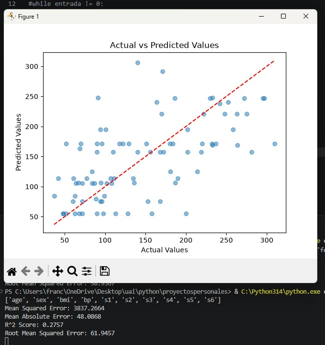
 
**Resultados:** MSE = 3837.2664, MAE = 48.0868, R² = 0.2757, RMSE = 61.9457.
 
**Con `max_depth=3`:**
 
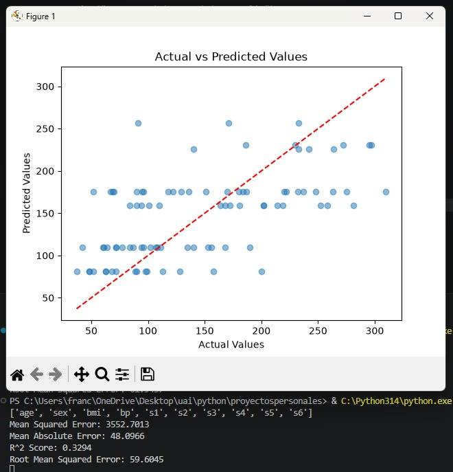
 
**Resultados:** MSE = 3552.7013, MAE = 48.0966, R² = 0.3294, RMSE = 59.6045.
 
**Análisis:** Limitar la profundidad del árbol confirma la hipótesis de sobreajuste planteada inicialmente: a medida que se restringe la complejidad del modelo, el R² mejora de forma sostenida, pasando de -0.0491 (sin restricción) a 0.2757 (`max_depth=5`) y finalmente a 0.3294 (`max_depth=3`). Esto es consistente con el comportamiento esperado en datasets pequeños como Diabetes (442 muestras, ~353 para entrenamiento): un árbol sin restricciones crece hasta ajustarse casi perfectamente al conjunto de entrenamiento, memorizando ruido en lugar de capturar un patrón generalizable, mientras que limitar la profundidad obliga al modelo a conservar solo las divisiones más informativas, mejorando la capacidad de generalización. Aun así, `max_depth=3` sigue siendo notablemente inferior a SVR con `C=100` (R² = 0.5078, la mejor marca para este dataset en el trabajo), lo que sugiere que la estructura de partición por umbrales de un árbol no es la más adecuada para capturar las relaciones entre las variables clínicas de Diabetes y la progresión de la enfermedad, en comparación con un modelo de margen como SVR.
 
### Dataset: Bike Sharing
 
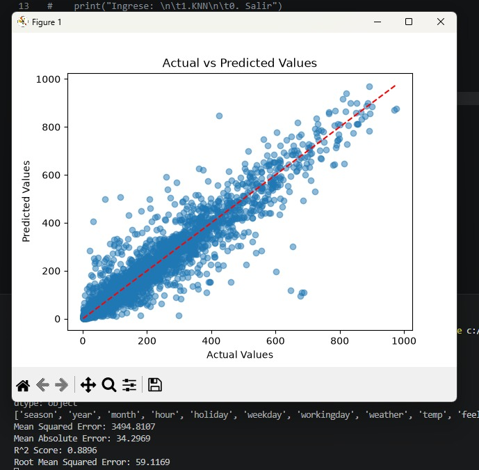
 
**Resultados:** MSE = 3494.8107, MAE = 34.2969, R² = 0.8896, RMSE = 59.1169.
 
**Análisis:** El dataset Bike Sharing Demand contiene registros horarios de un sistema de bicicletas compartidas, con variables temporales y climáticas (estación, año, mes, hora del día, día de la semana, condición laboral, clima, temperatura y sensación térmica) como predictoras de la demanda total de alquileres. El árbol sin restricción de profundidad alcanza un R² de 0.8896, sensiblemente superior a todos los demás resultados de regresión de este trabajo. Esto se explica principalmente por el volumen de datos disponible (decenas de miles de registros horarios), que le permite al árbol construir particiones finas sin caer en el sobreajuste severo observado en Diabetes, dataset mucho más pequeño. Además, variables como la hora del día y la estación del año tienen una relación fuertemente no lineal y escalonada con la demanda de bicicletas (picos en horarios laborales, caídas en horarios nocturnos), un patrón que un árbol de decisión, al dividir el espacio en regiones discretas, captura de forma más natural que un modelo lineal.
 
---
 
## 7. Random Forest (regresión)
 
**Algoritmo:** `RandomForestRegressor` de scikit-learn (ensamble de árboles de decisión mediante *bagging*).
 
### Dataset: California Housing
 
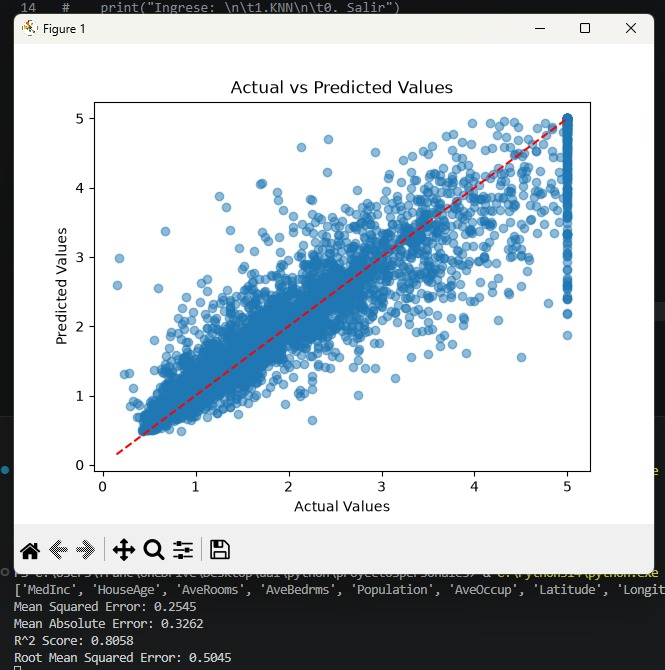
 
**Resultados:** MSE = 0.2545, MAE = 0.3262, R² = 0.8058, RMSE = 0.5045.
 
**Análisis:** El Random Forest logra el mejor resultado obtenido hasta el momento para California Housing en este trabajo (R² = 0.8058), superando ampliamente al árbol de decisión individual (0.6182), a SVR escalado (0.7276) y a los modelos de regresión lineal múltiple (0.58) y polinomial (0.54). Esta mejora respecto del árbol individual es el comportamiento esperado de un método de ensamble basado en *bagging*: al promediar las predicciones de múltiples árboles entrenados sobre submuestras distintas del dataset, el Random Forest reduce la varianza del modelo sin aumentar significativamente su sesgo, atenuando el efecto de las particiones ruidosas que un único árbol podría aprender. La franja vertical en el valor `5` sigue presente en el gráfico, dado que la censura del precio de las viviendas en el dataset original afecta a cualquier algoritmo utilizado, independientemente de su capacidad de ajuste.
 
### Dataset: Diabetes
 
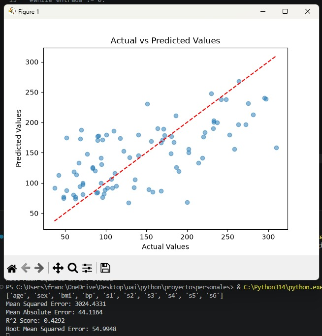
 
**Resultados:** MSE = 3024.4331, MAE = 44.1164, R² = 0.4292, RMSE = 54.9948.
 
**Análisis:** Sobre Diabetes, el Random Forest obtiene un R² de 0.4292, una mejora considerable respecto del árbol de decisión individual con `max_depth=3` (0.3294) y respecto del árbol sin restricción (-0.0491), confirmando nuevamente el beneficio del ensamble frente a un único estimador en un dataset pequeño y propenso al sobreajuste. Sin embargo, el resultado continúa por debajo del obtenido con SVR y `C=100` (0.5078), que se mantiene como el mejor algoritmo de regresión probado para este dataset en el trabajo. Esto sugiere que, más allá de mitigar el sobreajuste mediante el promedio de múltiples árboles, la estructura de partición por umbrales sigue siendo menos adecuada que un modelo de margen para capturar las relaciones —posiblemente más suaves y continuas— entre las variables clínicas y la progresión de la diabetes.
 
### Dataset: Air Quality
 
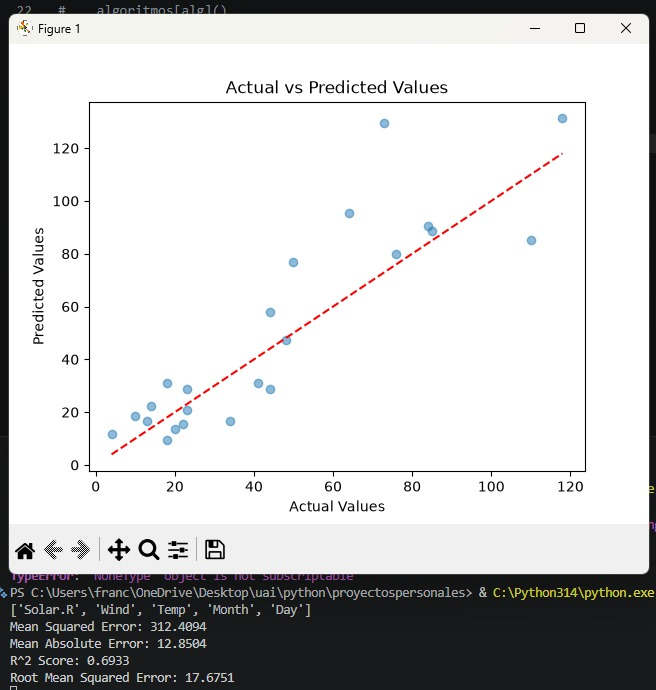
 
**Resultados:** MSE = 312.4094, MAE = 12.8504, R² = 0.6933, RMSE = 17.6751.
 
**Nota de preprocesamiento:** al igual que en Automobile y Energy Efficiency, este dataset presentó una dificultad particular en su carga: al especificar `target_column=None` para que la librería identificara automáticamente la columna objetivo, se generó un error (`TypeError: 'NoneType' object is not subscriptable`) al intentar acceder a una columna inexistente. La solución fue extraer manualmente la columna `Ozone` del DataFrame combinado devuelto por OpenML antes de separar variables predictoras (`Solar.R`, `Wind`, `Temp`, `Month`, `Day`) y target.
 
**Análisis:** Con un R² de 0.6933, el modelo logra un ajuste razonable sobre un dataset pequeño (apenas un centenar de observaciones diarias), comparable al obtenido con SVR sobre Energy Efficiency (0.7327). El gráfico de dispersión muestra, no obstante, una mayor dispersión relativa que en los datasets de mayor tamaño del trabajo, esperable dado el escaso número de muestras de test disponibles para evaluar el modelo, lo que hace que cada predicción individual tenga un peso proporcionalmente mayor sobre la métrica final.
 
**Conclusión general de la sección:** en los tres datasets evaluados, el Random Forest igualó o superó el desempeño del árbol de decisión individual, confirmando el principio general de que los métodos de ensamble basados en *bagging* reducen la varianza del modelo a costa de un mayor costo computacional y una menor interpretabilidad. La mejora es particularmente notable en California Housing, donde el Random Forest se posiciona como el mejor algoritmo de regresión de todo el trabajo hasta el momento.
 
---
 
## 8. Regresión logística
 
**Algoritmo:** `LogisticRegression` de scikit-learn, clasificación binaria.
 
### Dataset: Breast Cancer
 
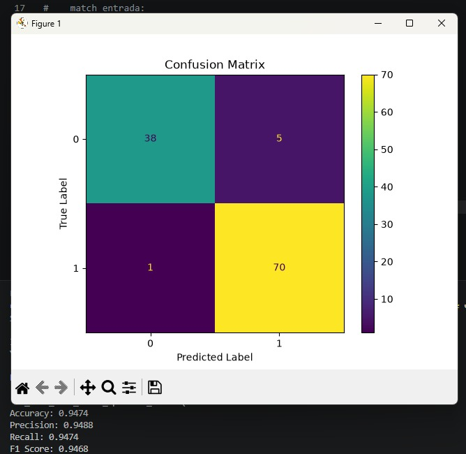
 
**Resultados:** Accuracy = 0.9474, Precision = 0.9488, Recall = 0.9474, F1 Score = 0.9468.
 
**Análisis:** De los 114 casos del conjunto de test, solo 6 fueron clasificados incorrectamente: 5 tumores malignos predichos como benignos (falsos negativos) y 1 tumor benigno predicho como maligno (falso positivo), asumiendo la codificación estándar del dataset (0 = maligno, 1 = benigno). Si bien la accuracy general es alta, en un contexto clínico real los falsos negativos —pacientes con un tumor maligno clasificados como sanos— tienen un costo mucho mayor que los falsos positivos, por lo que el resultado, aunque bueno, debería evaluarse también en función de esa asimetría y no solo de la accuracy global.
 
### Dataset: Titanic
 
**Con `max_iter=100` (valor por defecto):**
 
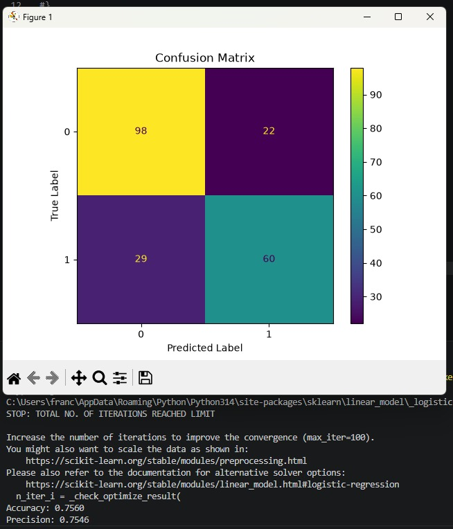
 
**Resultados:** Accuracy = 0.7560, Precision = 0.7546.
 
**Con `max_iter=500`:**
 
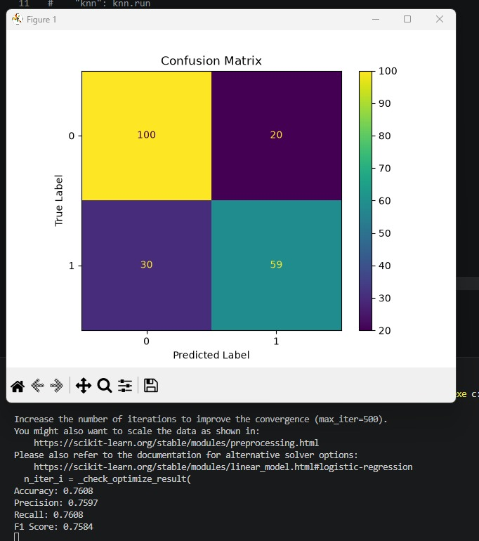
 
**Resultados:** Accuracy = 0.7608, Precision = 0.7597, Recall = 0.7608, F1 Score = 0.7584.
 
**Análisis:** Con los hiperparámetros por defecto (`max_iter=100`), el solver no llega a converger: scikit-learn emite una advertencia indicando que se alcanzó el límite de iteraciones sin satisfacer el criterio de optimización, y sugiere tanto aumentar `max_iter` como escalar las variables. Al aumentar `max_iter` a 500 la accuracy mejora levemente (de 0.7560 a 0.7608), pero la misma advertencia de convergencia persiste, lo que indica que el problema de fondo no es solo la cantidad de iteraciones sino la falta de escalado de las variables predictoras (por ejemplo, `fare` y `age` se encuentran en rangos numéricos muy distintos entre sí). Esto es consistente con la lección ya observada en SVR: los algoritmos que dependen de un proceso de optimización numérico (descenso de gradiente, en este caso) convergen de forma mucho más eficiente cuando las variables están en escalas comparables. Una mejora pendiente sería aplicar `StandardScaler` sobre las variables numéricas antes de entrenar el modelo, en lugar de simplemente aumentar el número de iteraciones.
 
### Dataset: Heart Disease
 
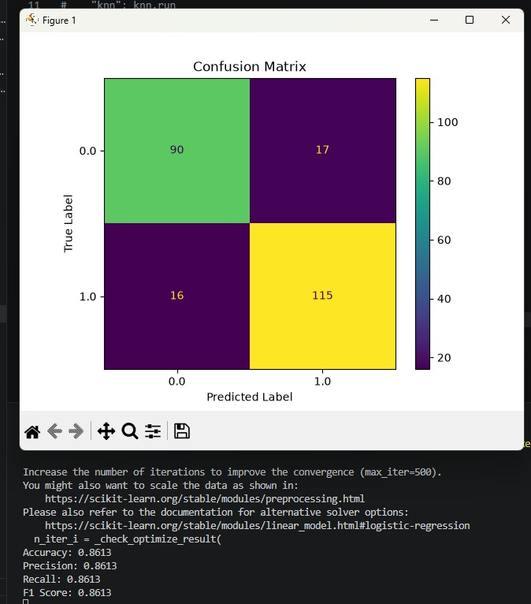
 
**Resultados:** Accuracy = 0.8613, Precision = 0.8613, Recall = 0.8613, F1 Score = 0.8613.
 
**Análisis:** Sobre Heart Disease se obtiene la mejor accuracy entre los tres datasets de clasificación binaria evaluados con regresión logística (0.8613), a pesar de que el solver emite la misma advertencia de convergencia que en Titanic. Esto sugiere que, si bien las variables de este dataset (edad, presión arterial, colesterol, frecuencia cardíaca máxima, etc.) también presentan escalas dispares y se beneficiarían de un escalado previo, la relación entre dichas variables y la presencia de enfermedad cardíaca es más fácilmente separable de forma lineal que en Titanic, donde factores socioeconómicos y categóricos (clase del pasajero, puerto de embarque, etc.) probablemente introducen relaciones más complejas y no estrictamente lineales con la supervivencia.
 
**Conclusión general de la sección:** en los tres datasets, la regresión logística logra resultados aceptables a buenos sin necesidad de ningún preprocesamiento adicional más allá de la codificación de variables categóricas, aunque las advertencias de convergencia en Titanic y Heart Disease dejan en evidencia que el escalado de variables —ya identificado como un paso indispensable para SVR en este trabajo— también beneficiaría a los algoritmos de optimización basados en gradiente como la regresión logística.
 
---
 
## 9. SVM (clasificación)
 
**Algoritmo:** `SVC` de scikit-learn, comparando los cuatro kernels disponibles (`rbf`, `linear`, `poly`, `sigmoid`).
 
### Dataset: Breast Cancer
 
**Kernel `rbf` (por defecto):**
 
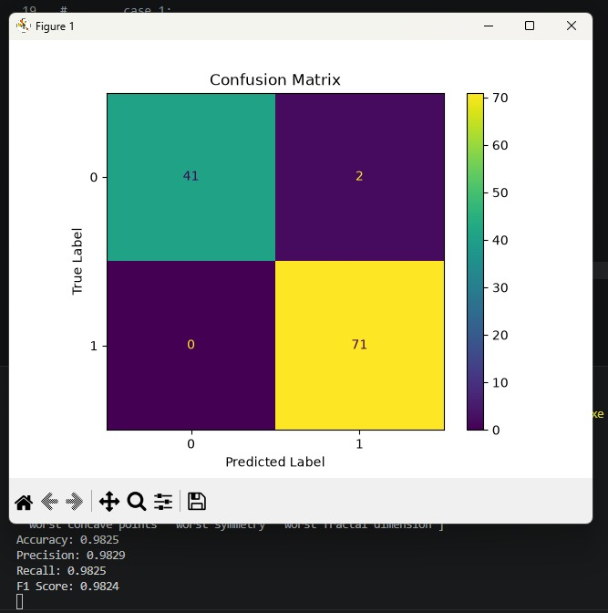
 
**Resultados:** Accuracy = 0.9825, Precision = 0.9829, Recall = 0.9825, F1 Score = 0.9824.
 
**Kernel `linear`:**
 
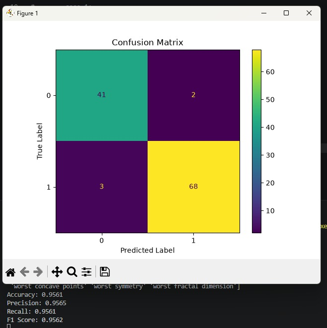
 
**Resultados:** Accuracy = 0.9561, Precision = 0.9565, Recall = 0.9561, F1 Score = 0.9562.
 
**Kernel `poly`:**
 
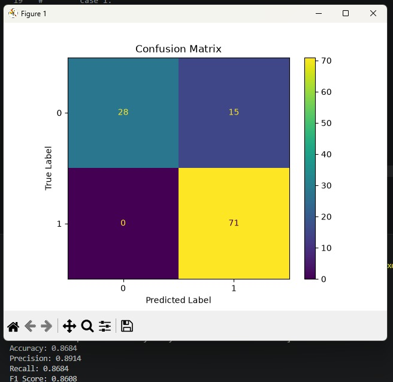
 
**Resultados:** Accuracy = 0.8684, Precision = 0.8914, Recall = 0.8684, F1 Score = 0.8608.
 
**Kernel `sigmoid`:**
 

 
**Resultados:** Accuracy = 0.9561, Precision = 0.9569, Recall = 0.9561, F1 Score = 0.9558.
 
**Análisis:** Comparando los cuatro kernels disponibles para SVC sobre el mismo conjunto de test (114 casos), el kernel `rbf` obtiene el mejor resultado (accuracy = 0.9825), seguido de cerca por `linear` y `sigmoid` (ambos con accuracy = 0.9561), mientras que `poly` resulta claramente el más débil (accuracy = 0.8684). La diferencia más relevante no está solo en la accuracy global sino en el tipo de error cometido: con el kernel `poly`, 15 de los 43 tumores malignos del conjunto de test fueron clasificados como benignos (falsos negativos), una tasa de error muy superior a la de los demás kernels (2 falsos negativos con `rbf` y `linear`, 4 con `sigmoid`). Esto indica que la frontera de decisión polinomial, con el grado por defecto, generaliza peor sobre este dataset que una frontera basada en distancias (`rbf`) o un hiperplano lineal, y que en un contexto clínico esta diferencia sería mucho más significativa que lo que sugiere la accuracy por sí sola. El buen desempeño general de los cuatro kernels —en comparación con la fuerte sensibilidad al escalado observada en SVR sobre California Housing y Diabetes— es consistente con que Breast Cancer es un dataset con clases bien separables, donde incluso fronteras de decisión relativamente simples logran un buen ajuste.
 
### Dataset: Iris
 
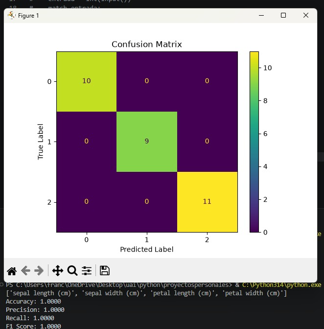
 
**Resultados:** Accuracy = 1.0000, Precision = 1.0000, Recall = 1.0000, F1 Score = 1.0000.
 
**Análisis:** Con el kernel `rbf` por defecto, SVM también clasifica las 30 muestras del conjunto de test sin ningún error, en línea con todos los demás algoritmos de clasificación probados sobre este dataset (KNN, árbol de decisión). Dado que las clases de Iris pueden separarse con muy pocas reglas simples —el largo del pétalo, por ejemplo, ya alcanza para distinguir Setosa del resto—, el accuracy perfecto no es indicio de overfitting sino una característica intrínseca de la separabilidad del problema.
 
### Dataset: Digits
 
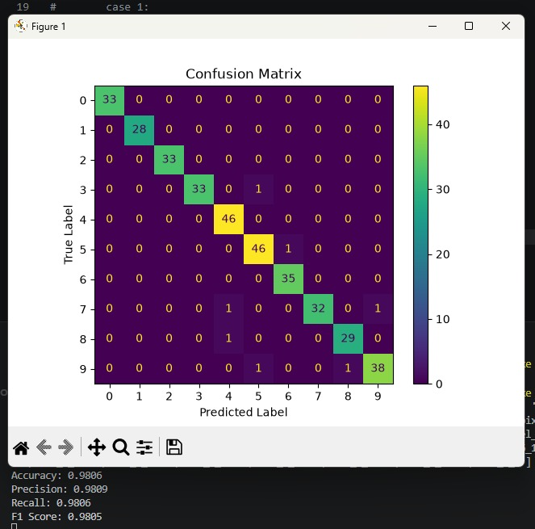
 
**Resultados:** Accuracy = 0.9806, Precision = 0.9809, Recall = 0.9806, F1 Score = 0.9805.
 
**Análisis:** Sobre Digits, que consiste en imágenes de 8x8 píxeles de dígitos manuscritos (64 variables predictoras, una por píxel), SVM con kernel `rbf` alcanza un accuracy de 0.9806, el mejor resultado obtenido para este dataset en todo el trabajo. Esto es consistente con una fortaleza conocida de SVM en problemas de alta dimensionalidad: el kernel `rbf` construye fronteras de decisión no lineales considerando la totalidad de los píxeles de forma conjunta, lo que le permite distinguir dígitos que pueden confundirse visualmente (por ejemplo, 3 y 8, o 4 y 9), como se observa en los pocos errores fuera de la diagonal de la matriz de confusión.
 
**Conclusión general de la sección:** considerando los tres datasets evaluados, SVM con kernel `rbf` se confirma como un algoritmo robusto tanto en datasets pequeños y bien separados (Iris, Breast Cancer) como en datasets de mayor dimensionalidad (Digits), sin necesidad de ningún ajuste de hiperparámetros adicional al kernel. La única excepción de bajo desempeño en esta sección fue el kernel `poly` sobre Breast Cancer, lo que sugiere que la elección del kernel resulta más determinante para el resultado final que el dataset en sí.
 
---
 
## 10. Naive Bayes
 
**Algoritmo:** `GaussianNB` para datasets con variables numéricas continuas, y `MultinomialNB` para datos de conteo (texto).
 
### Dataset: Iris (GaussianNB)
 
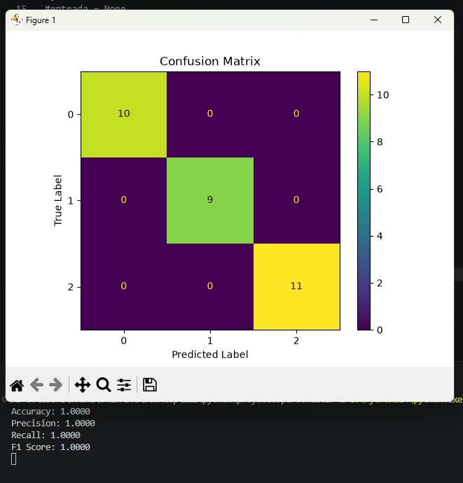
 
**Resultados:** Accuracy = 1.0000, Precision = 1.0000, Recall = 1.0000, F1 Score = 1.0000.
 
**Análisis:** `GaussianNB` asume que cada variable predictora sigue una distribución normal dentro de cada clase. Sobre Iris esta suposición resulta razonable: las medidas de sépalos y pétalos dentro de cada especie se distribuyen de forma aproximadamente gaussiana y con poca superposición entre clases, lo que permite que el modelo clasifique las 30 muestras de test sin ningún error, igualando el resultado obtenido con KNN, el árbol de decisión y SVM sobre este mismo dataset.
 
### Dataset: Wine (GaussianNB)
 
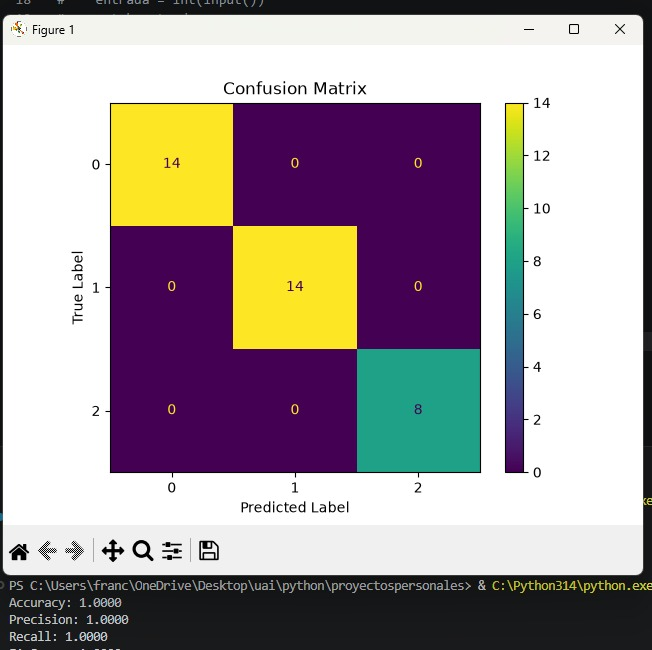
 
**Resultados:** Accuracy = 1.0000, Precision = 1.0000, Recall = 1.0000, F1 Score = 1.0000.
 
**Análisis:** Sobre Wine, un dataset de 13 variables químicas continuas (alcohol, ácido málico, fenoles totales, etc.) y 3 clases de cultivares, `GaussianNB` también logra un accuracy perfecto sobre las 36 muestras de test. Esto sugiere que, al igual que en Iris, las distribuciones de las variables químicas dentro de cada clase de cultivar son lo suficientemente distintas entre sí —y razonablemente cercanas a una gaussiana— como para que la suposición de independencia condicional entre variables, la simplificación más fuerte de Naive Bayes, no termine perjudicando el resultado final.
 
### Dataset: 20 Newsgroups (MultinomialNB)
 
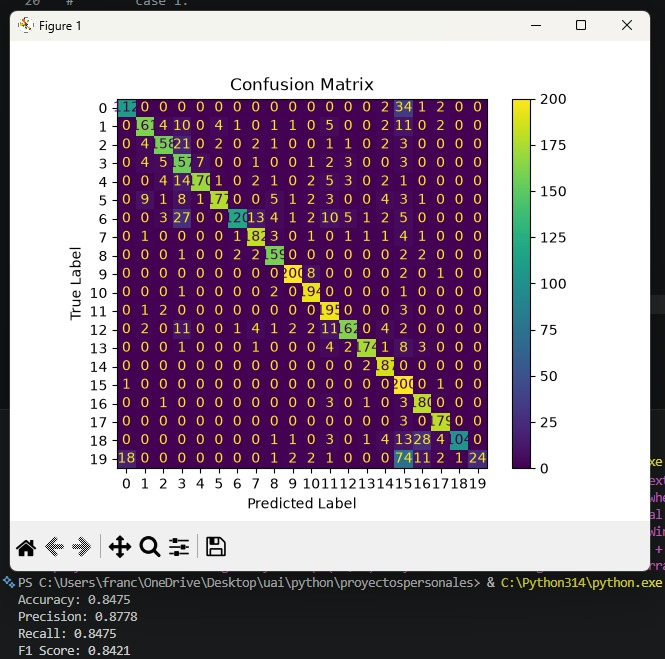
 
**Resultados:** Accuracy = 0.8475, Precision = 0.8778, Recall = 0.8475, F1 Score = 0.8421.
 
**Análisis:** 20 Newsgroups es un dataset de clasificación de texto con 20 categorías temáticas (deportes, religión, política, tecnología, etc.), representado mediante una matriz de conteo de palabras o TF-IDF, el escenario para el cual `MultinomialNB` fue diseñado específicamente. El modelo alcanza un accuracy de 0.8475, sensiblemente menor al de Iris o Wine, pero un resultado sólido considerando que se trata de un problema de 20 clases con un vocabulario de miles de palabras. En la matriz de confusión se observan algunas confusiones esperables entre categorías temáticamente cercanas (por ejemplo, entre distintos foros de tecnología o de religión), mientras que las categorías con vocabulario más distintivo logran una clasificación casi perfecta. La diferencia entre precision (0.8778) y recall (0.8475) indica que el modelo es algo más conservador: cuando predice una clase, suele tener razón con mayor frecuencia que la frecuencia con la que logra identificar correctamente todas las muestras reales de esa clase.
 
**Conclusión general de la sección:** el fuerte contraste entre el accuracy perfecto de `GaussianNB` sobre Iris y Wine, y el 0.85 de `MultinomialNB` sobre 20 Newsgroups, no refleja una diferencia de calidad entre ambas variantes del algoritmo sino la diferencia de dificultad entre los problemas: clasificar 3 clases a partir de un puñado de variables numéricas bien separadas es un problema mucho más simple que clasificar 20 categorías temáticas a partir de miles de variables de conteo de palabras, con vocabulario superpuesto entre clases relacionadas.
 
---
 
## 11. Árbol de decisión (clasificación)
 
**Algoritmo:** `DecisionTreeClassifier` de scikit-learn.
 
### Dataset: Iris
 
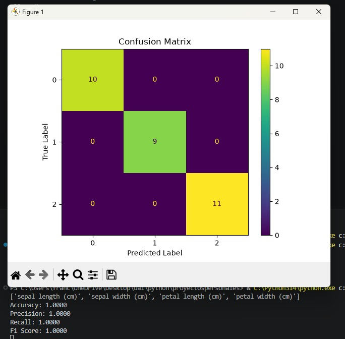
 
**Resultados:** Accuracy = 1.0000, Precision = 1.0000, Recall = 1.0000, F1 Score = 1.0000.
 
**Análisis:** Un único árbol de decisión, sin ninguna restricción de profundidad, también logra un accuracy perfecto sobre Iris, en línea con todos los algoritmos de clasificación probados hasta el momento sobre este dataset. Dado que las clases pueden separarse con muy pocas reglas de umbral, el árbol encuentra esta solución de forma casi inmediata sin necesidad de crecer en profundidad.
 
### Dataset: Breast Cancer
 
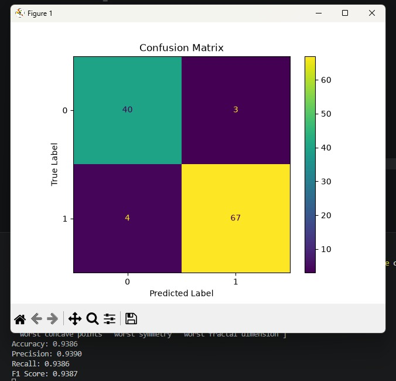
 
**Resultados:** Accuracy = 0.9386, Precision = 0.9390, Recall = 0.9386, F1 Score = 0.9387.
 
**Análisis:** Sobre Breast Cancer, el árbol de decisión obtiene un accuracy de 0.9386, levemente inferior al de la regresión logística (0.9474) y al de SVM con los kernels `rbf` y `linear` (0.9825 y 0.9561 respectivamente) sobre el mismo dataset. De los 7 errores cometidos, 3 corresponden a tumores benignos clasificados como malignos (falsos positivos) y 4 a tumores malignos clasificados como benignos (falsos negativos), este último el tipo de error más costoso en un contexto clínico real, ya que implica diagnósticos malignos no detectados.
 
### Dataset: Digits
 
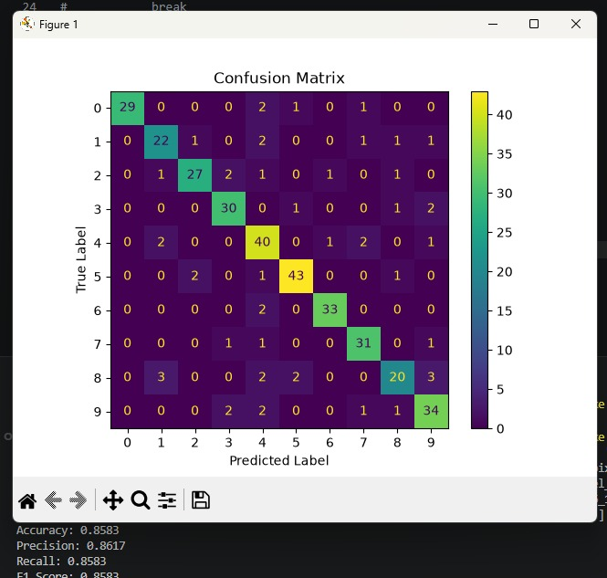
 
**Resultados:** Accuracy = 0.8583, Precision = 0.8617, Recall = 0.8583, F1 Score = 0.8583.
 
**Análisis:** Sobre Digits, el árbol de decisión obtiene el peor resultado entre todos los algoritmos de clasificación probados sobre este dataset (accuracy = 0.8583, frente a 0.9806 de SVM). Esto es consistente con una limitación conocida de los árboles de decisión: al dividir el espacio de variables con cortes ortogonales (un píxel a la vez), les resulta difícil capturar patrones donde la información relevante está distribuida de forma combinada entre múltiples píxeles vecinos, una situación habitual en el reconocimiento de imágenes incluso a baja resolución (8x8 píxeles, en este caso). Métodos como SVM, que consideran la totalidad de las variables de forma conjunta a través de su kernel, logran una ventaja considerable en este tipo de problemas.
 
**Conclusión general de la sección:** el árbol de decisión iguala a los demás algoritmos en Iris, un problema simple, pero queda por detrás en Breast Cancer y, sobre todo, en Digits, donde la limitación de las particiones ortogonales se vuelve más evidente. Esto motiva naturalmente el uso de Random Forest, evaluado en la siguiente sección sobre estos mismos tres datasets.
 
---
 
## 12. Random Forest (clasificación)
 
**Algoritmo:** `RandomForestClassifier` de scikit-learn.
 
### Dataset: Breast Cancer
 
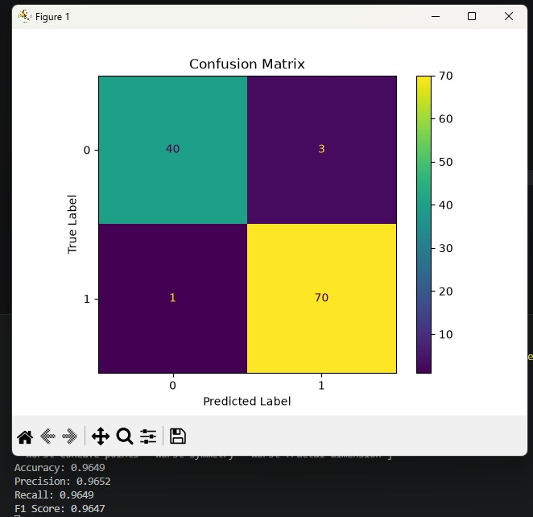
 
**Resultados:** Accuracy = 0.9649, Precision = 0.9652, Recall = 0.9649, F1 Score = 0.9647.
 
**Análisis:** El Random Forest reduce notablemente los errores del árbol individual sobre Breast Cancer: de 7 errores totales (3 falsos positivos y 4 falsos negativos, accuracy = 0.9386) a 4 errores totales (3 falsos positivos y 1 falso negativo, accuracy = 0.9649). La mejora es particularmente valiosa desde el punto de vista clínico, ya que los falsos negativos —tumores malignos no detectados— se reducen de 4 a 1, gracias a que el promedio de múltiples árboles entrenados sobre distintas submuestras del dataset corrige buena parte de los errores idiosincráticos que comete un único árbol. El resultado se ubica entre el de SVM con kernel `linear`/`sigmoid` (0.9561) y el mejor resultado de la sección de SVM, kernel `rbf` (0.9825).
 
### Dataset: Wine
 
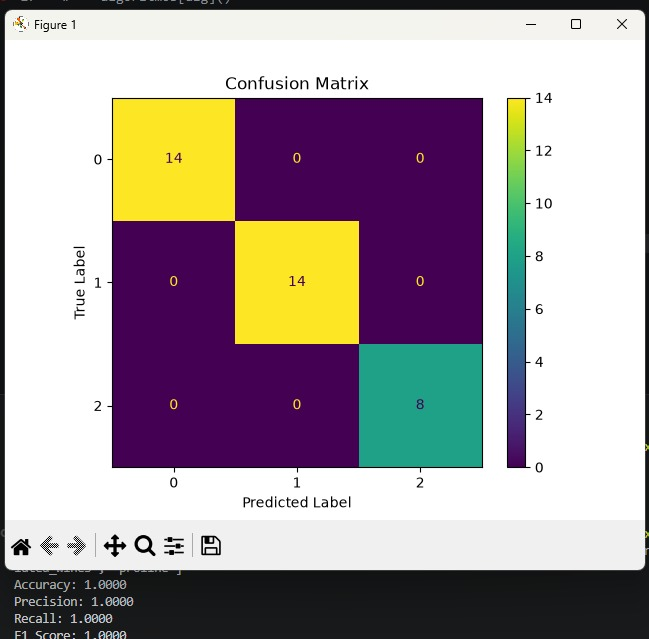
 
**Resultados:** Accuracy = 1.0000, Precision = 1.0000, Recall = 1.0000, F1 Score = 1.0000.
 
**Análisis:** Sobre Wine, el Random Forest también alcanza un accuracy perfecto, igualando a `GaussianNB` sobre el mismo dataset. Esto confirma que Wine es, junto con Iris, uno de los datasets más fácilmente separables de todo el trabajo: con solo 13 variables químicas continuas y 3 clases de cultivares razonablemente distintas entre sí, prácticamente todos los algoritmos de clasificación evaluados logran un desempeño cercano o igual al máximo.
 
### Dataset: Digits
 
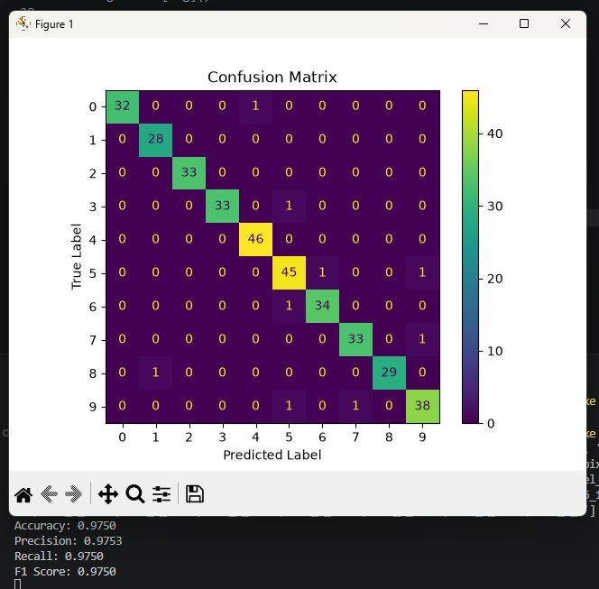
 
**Resultados:** Accuracy = 0.9750, Precision = 0.9753, Recall = 0.9750, F1 Score = 0.9750.
 
**Análisis:** Sobre Digits, el Random Forest obtiene un accuracy de 0.9750, una mejora sustancial respecto del árbol de decisión individual (0.8583) y muy cercana al mejor resultado obtenido para este dataset en el trabajo (SVM kernel `rbf`, 0.9806). Esto confirma, una vez más, que el ensamble de múltiples árboles mediante *bagging* compensa la principal debilidad de un árbol individual frente a datos de alta dimensionalidad como las imágenes: al combinar muchos árboles entrenados sobre subconjuntos distintos de variables y muestras, el Random Forest logra capturar combinaciones de píxeles relevantes que un único árbol, limitado a cortes ortogonales secuenciales, difícilmente captura por sí solo.
 
**Conclusión general de la sección:** en los tres datasets, el Random Forest igualó o superó claramente al árbol de decisión individual, con la mejora más marcada en Digits, el dataset de mayor dimensionalidad de los tres. Considerando todos los algoritmos de clasificación evaluados en el trabajo, Random Forest y SVM (kernel `rbf`) quedan como las opciones más sólidas y consistentes a lo largo de los distintos datasets, mientras que el árbol de decisión individual y el kernel `poly` de SVM resultan las opciones más débiles en sus respectivas secciones.
 
---
 
## 13. Pendientes generales
 
- **KNN:** datasets Wine y Digits.
- **Regresión lineal simple:** datasets California Housing y Boston Housing.
- **Regresión lineal múltiple:** dataset Wine Quality.
- **Regresión logística:** aplicar `StandardScaler` sobre Titanic y Heart Disease para evaluar si se resuelve la advertencia de convergencia y mejora la accuracy.
Con esto, los 12 algoritmos del TP cuentan con al menos un dataset evaluado. Lo que queda pendiente son datasets adicionales sobre algoritmos ya implementados (KNN y las regresiones lineales), más la mejora de escalado en regresión logística.